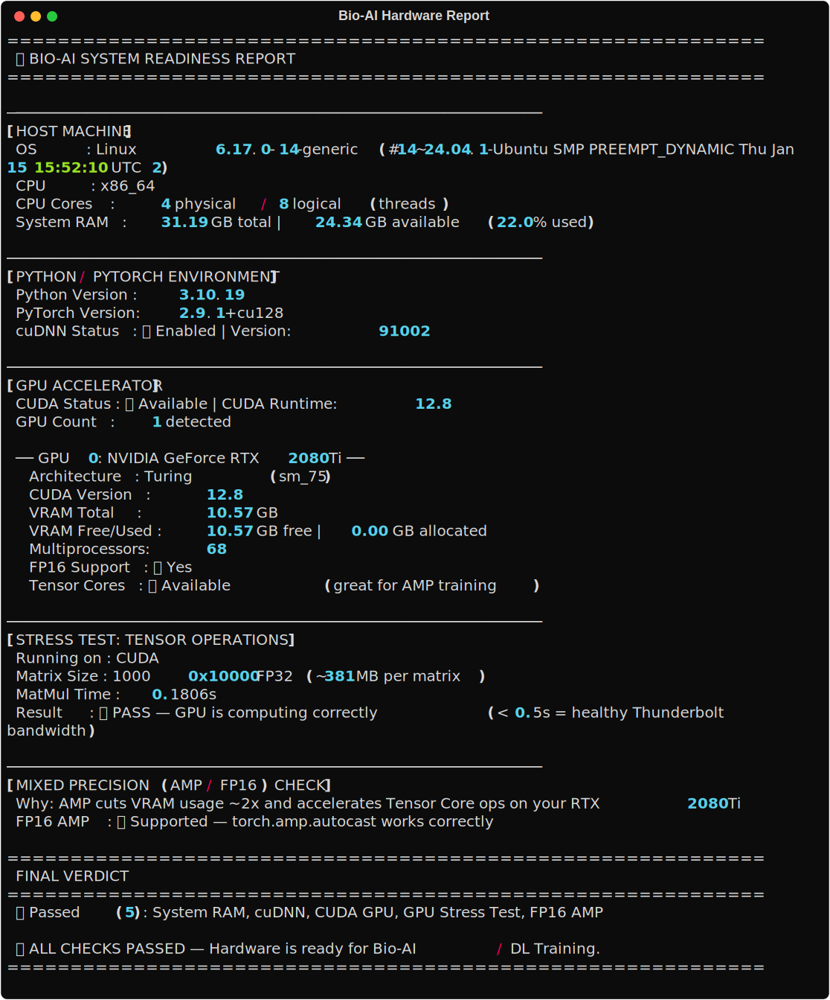

# 🖥️ Hardware Configuration — Bio-AI Foundations

> Validated with [`hardware/hardware_validator.py`](./hardware/hardware_validator.py)  
> Report generated by [`hardware/export_report.py`](./hardware/export_report.py)  
> Last updated: March 2026 · Platform: Ubuntu 24.04 LTS

---

## Terminal Report



---

## System Specifications

### 🖲️ Host Machine

| Component      | Details                                                   |
|----------------|-----------------------------------------------------------|
| **OS**         | Ubuntu 24.04 LTS — Kernel `6.17.0-14-generic`            |
| **CPU Arch**   | x86_64                                                    |
| **CPU Cores**  | 4 physical / 8 logical (Hyper-Threading enabled)          |
| **System RAM** | 31.19 GB total · 24.52 GB available at test time (21.4% used) |

### ⚡ GPU Accelerator

| Component           | Details                                            |
|---------------------|----------------------------------------------------|
| **GPU**             | NVIDIA GeForce RTX 2080 Ti                         |
| **VRAM**            | 10.57 GB GDDR6                                     |
| **Architecture**    | Turing (sm_75)                                     |
| **Multiprocessors** | 68 SMs                                             |
| **Tensor Cores**    | ✅ Available — FP16/AMP acceleration enabled       |
| **FP16 Support**    | ✅ Yes                                             |
| **Connection**      | Thunderbolt 3 eGPU Enclosure                       |

### 🐍 Software Environment

| Component      | Version                  |
|----------------|--------------------------|
| **Python**     | 3.10.19                  |
| **PyTorch**    | 2.9.1+cu128              |
| **CUDA**       | 12.8                     |
| **cuDNN**      | 9.1.0 ✅ Enabled         |
| **Conda Env**  | `pytorch-gpu`            |

---

## Validation Results

### ✅ Stress Test — 10,000 × 10,000 FP32 Matrix Multiplication

| Metric           | Result                                                |
|------------------|-------------------------------------------------------|
| **Matrix Size**  | 10,000 × 10,000 FP32 (~381 MB per matrix)             |
| **Device**       | CUDA — NVIDIA GeForce RTX 2080 Ti                     |
| **MatMul Time**  | **0.1737s** ✅ _(< 0.5s = healthy Thunderbolt bandwidth)_ |
| **Result**       | ✅ PASS — GPU computing correctly                     |

### ✅ Automatic Mixed Precision (AMP / FP16)

| Check              | Status                                              |
|--------------------|-----------------------------------------------------|
| **FP16 autocast**  | ✅ Supported — `torch.amp.autocast` verified        |
| **Tensor Cores**   | ✅ Active (Turing sm_75)                            |
| **VRAM benefit**   | ~2× memory reduction during AMP training            |

### 🏁 Final Verdict

| Check            | Status   |
|------------------|----------|
| System RAM       | ✅ Pass  |
| cuDNN            | ✅ Pass  |
| CUDA GPU         | ✅ Pass  |
| GPU Stress Test  | ✅ Pass  |
| FP16 AMP         | ✅ Pass  |

> 🚀 **ALL CHECKS PASSED (5/5) — Hardware is ready for Bio-AI / Deep Learning Training.**

---

## Reproducing This Report

```bash
# Activate the conda environment
conda activate pytorch-gpu

# Run the hardware validator
python hardware/hardware_validator.py

# Regenerate the SVG terminal report
python hardware/export_report.py
```

**Dependencies** (included in `pytorch-gpu` conda env):

```
torch==2.9.1+cu128    # PyTorch with CUDA 12.8 support
psutil                # System memory & CPU introspection
rich                  # Terminal SVG export
```

---

## Why This Hardware Setup?

This project applies deep learning to **computational biology and metagenomics**.
The RTX 2080 Ti is validated here as the primary compute device for:

- 🧬 **eDNA / Environmental DNA** sequence classification with deep neural networks
- 🔬 Augmenting taxonomic classification pipelines (e.g., Kraken2 + DL post-filtering)
- 🤖 Fine-tuning distilled biological language models (e.g., ESM, DNABERT)

**Key capability:** Turing Tensor Cores + FP16 AMP support allows training
transformer-based models on biological sequences at ~2× the throughput
and ~2× the VRAM efficiency of standard FP32 training — critical when
working within a 10.57 GB VRAM budget.

---

*Report auto-generated by [`hardware_validator.py`](./hardware/hardware_validator.py) —
a Bio-AI hardware readiness tool for Ubuntu + PyTorch + CUDA environments.*
